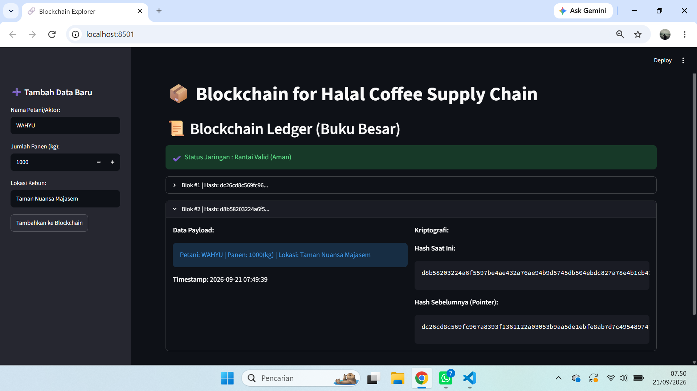

PRAKTIKUM BLOKCHAIN PERTEMUAN3

Tujuan Praktikum
1.mahaiswa mampu memahami konsep object=oriented programing(oop)pada python memlalui pembuatan class.
2.Mahasiswa mampu mengimplementasikan arsitektur modular dengan memisahkan logika (ui).
3.Mahasiswa dapat membangun struktur linkked list terenskripsi menggunakan hash pointers.
4.Mahasiswa mampu mensimulasikan sistem "traceability rantai pasok kopi" sederhana dilingkungan lokal.

DESKRIPSI PRAKTIKUM
1.Membuat 2 buah file di dalam folder pertemuan 3  yaitu: core.py dan app.py

