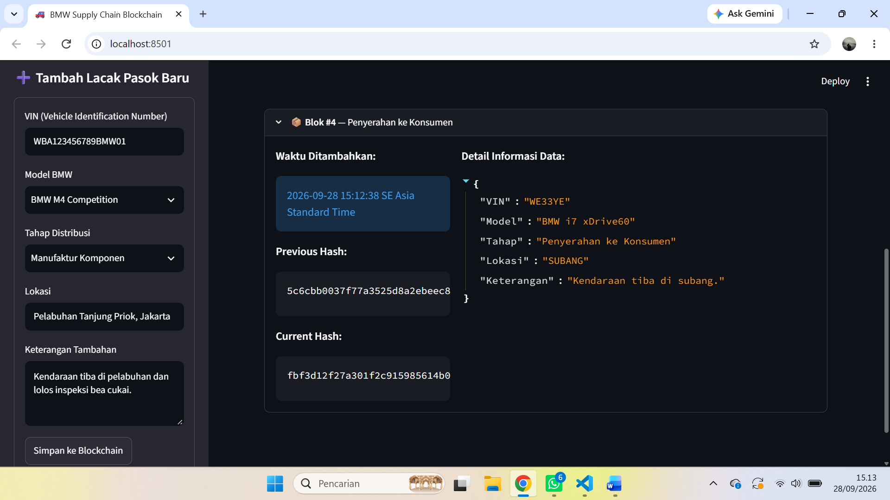

# LAPORAN TUGAS PROJEK KELOMPOK
## BMW Supply Chain Blockchain Ledger: Sistem Pelacakan Rantai Pasok Berbasis Streamlit & SHA-256

---

**Mata Kuliah:** Blockchain
**Dosen Pengampu:** [Nama Dosen, S.Kom., M.T.]  
**Kelas:** 3 INF D
 

---

### Anggota Kelompok:
1. **Nizar Aftana** - 2530801081
2. **Wafah Khonia** - 2530801081
3. **Wahyu** - 2530801081

---

### A. TUJUAN PEMBELAJARAN

1. Mahasiswa memahami konsep Object-Oriented Programming (OOP) pada Python melalui penerapan class dalam sistem blockchain.
2. Mahasiswa mampu menerapkan arsitektur modular dengan memisahkan bagian backend dan frontend pada aplikasi.
3. Mahasiswa memahami konsep dasar Blockchain, khususnya penggunaan block, hash, dan hash pointer dalam membentuk sebuah rantai data.
4. Mahasiswa mampu menerapkan algoritma SHA-256 untuk menjaga integritas data pada setiap blok.
5. Mahasiswa mampu membangun sistem sederhana untuk melakukan pelacakan rantai pasok kendaraan BMW secara terstruktur.
6. Mahasiswa mampu melakukan simulasi perubahan data atau tampering untuk mengetahui cara kerja validasi keamanan pada blockchain.

### B. KONSEP ARSITEKTUR MODULAR

Pada project ini, aplikasi blockchain dikembangkan menggunakan konsep arsitektur modular. Sistem dibagi menjadi dua bagian utama, yaitu backend dan frontend. Pemisahan tersebut dilakukan agar logika utama blockchain tidak tercampur dengan bagian antarmuka aplikasi.

1. Backend

Backend merupakan bagian yang bertugas mengatur proses utama blockchain. Pada project ini, backend menangani pembuatan blok, pembentukan rantai blockchain, proses hashing menggunakan SHA-256, penambahan data baru, serta pemeriksaan validitas rantai.

Backend terdiri dari dua class utama, yaitu Block dan Blockchain.

Class Block digunakan untuk menyimpan informasi sebuah blok, seperti nomor blok, waktu pembuatan, data, hash dari blok sebelumnya, dan hash dari blok tersebut.

Sementara itu, class Blockchain digunakan untuk mengatur keseluruhan rantai blok. Class ini bertugas membuat Genesis Block, menambahkan blok baru, serta melakukan validasi terhadap seluruh rantai blockchain.

2. Frontend

Frontend digunakan sebagai antarmuka yang memungkinkan pengguna berinteraksi dengan sistem blockchain. Pada project ini, frontend dibuat menggunakan Streamlit sehingga aplikasi dapat dijalankan melalui web browser.

Melalui antarmuka tersebut, pengguna dapat melihat status blockchain, melihat riwayat rantai pasok, menambahkan data perjalanan kendaraan, serta melakukan simulasi manipulasi data untuk menguji sistem validasi blockchain.

### C. DESKRIPSI PROJECT

Project yang dibuat merupakan sistem BMW Supply Chain Blockchain Ledger, yaitu sistem sederhana untuk melakukan pelacakan perjalanan kendaraan BMW dalam rantai pasok.

Rantai pasok kendaraan terdiri dari beberapa tahapan, mulai dari proses manufaktur komponen, perakitan akhir, pengujian kualitas, proses logistik dan pengiriman, penerimaan oleh dealer, hingga kendaraan diserahkan kepada konsumen.

Setiap tahapan tersebut disimpan sebagai sebuah blok di dalam blockchain. Data yang disimpan meliputi VIN (Vehicle Identification Number), model kendaraan, tahap proses, lokasi, dan keterangan tambahan.

Penggunaan blockchain pada project ini bertujuan untuk memberikan mekanisme pencatatan yang dapat mendeteksi apabila data yang telah tersimpan mengalami perubahan.

### D. LANGKAH KERJA PROJECT

Tahap 1: Membuat Struktur Blockchain

Tahap pertama adalah membangun struktur blockchain yang terdiri dari beberapa blok yang saling terhubung.

Setiap blok memiliki informasi berupa nomor blok, timestamp, data, previous hash, dan current hash. Hash pada setiap blok digunakan sebagai identitas unik yang terbentuk berdasarkan isi data blok tersebut.

Tahap 2: Membuat Genesis Block

Blockchain diawali dengan sebuah Genesis Block. Genesis Block merupakan blok pertama yang menjadi titik awal dari rantai blockchain.

Pada project ini, Genesis Block digunakan sebagai blok inisialisasi untuk ledger BMW Supply Chain.

Tahap 3: Menambahkan Data Rantai Pasok

Setelah Genesis Block dibuat, sistem menambahkan data awal mengenai perjalanan kendaraan BMW.

Contoh data awal yang digunakan adalah:

- BMW M4 Competition
- Tahap manufaktur komponen
- Lokasi pabrik Munich, Jerman
- Tahap perakitan akhir
- Lokasi pabrik Dingolfing, Jerman

Setiap data baru akan dibuat menjadi blok baru dan dihubungkan dengan hash dari blok sebelumnya.

Tahap 4: Proses Hashing SHA-256

Setiap blok menghasilkan hash menggunakan algoritma SHA-256. Hash tersebut diperoleh berdasarkan gabungan informasi yang terdapat di dalam blok.

Jika terdapat perubahan pada data blok setelah hash dibuat, hasil perhitungan hash baru akan berbeda dengan hash yang tersimpan sebelumnya. Kondisi tersebut dapat digunakan untuk mendeteksi adanya perubahan data.

Tahap 5: Validasi Blockchain

Sistem melakukan validasi untuk memastikan bahwa setiap blok masih dalam kondisi valid.

Validasi dilakukan dengan dua pemeriksaan utama:

1. Memastikan hash yang tersimpan pada suatu blok masih sama dengan hasil perhitungan hash berdasarkan data blok tersebut.
2. Memastikan nilai "previous_hash" pada suatu blok sesuai dengan hash dari blok sebelumnya.

Jika kedua pemeriksaan tersebut terpenuhi, blockchain dinyatakan valid.

Tahap 6: Menambahkan Data Melalui Antarmuka

Pengguna dapat menambahkan informasi rantai pasok baru melalui form yang tersedia pada bagian sidebar aplikasi.

Data yang dapat dimasukkan meliputi:

- VIN kendaraan
- Model BMW
- Tahap distribusi
- Lokasi
- Keterangan tambahan

Setelah data disimpan, sistem akan membuat blok baru dan memasukkannya ke dalam blockchain.

Tahap 7: Simulasi Tampering

Project juga menyediakan fitur simulasi tampering atau manipulasi data.

Fitur tersebut digunakan untuk mengubah keterangan pada salah satu blok secara langsung tanpa memperbarui hash yang telah tersimpan.

Setelah data dimanipulasi, sistem melakukan validasi ulang. Karena isi blok telah berubah tetapi hash tidak diperbarui, hasil perhitungan hash akan berbeda dengan hash yang tersimpan.

Dengan demikian, sistem dapat mendeteksi bahwa data pada blok tersebut telah mengalami perubahan.

### E. HASIL IMPLEMENTASI

Hasil implementasi project berupa sebuah aplikasi web interaktif yang menampilkan BMW Supply Chain Blockchain Ledger.

Pada halaman utama, pengguna dapat melihat status validitas blockchain dan seluruh riwayat rantai pasok kendaraan.

Setiap blok ditampilkan dengan informasi:

- Nomor blok
- Waktu penambahan data
- Previous Hash
- Current Hash
- Detail informasi rantai pasok

Selain melihat data, pengguna juga dapat menambahkan data rantai pasok baru melalui form yang tersedia.

Aplikasi juga memiliki fitur simulasi tampering. Fitur tersebut menunjukkan bagaimana blockchain dapat mendeteksi perubahan data yang dilakukan tanpa memperbarui hash.

### F. ANALISIS HASIL

Berdasarkan implementasi yang dilakukan, blockchain dapat digunakan sebagai salah satu pendekatan untuk menjaga integritas data pada sistem pelacakan rantai pasok.

Setiap blok memiliki hubungan dengan blok sebelumnya melalui previous hash. Hubungan tersebut membuat perubahan pada suatu blok dapat memengaruhi validitas rantai karena data yang telah diubah akan menghasilkan hash yang berbeda.

Penggunaan SHA-256 juga memberikan mekanisme untuk mendeteksi perubahan isi blok. Apabila data dalam sebuah blok dimodifikasi secara langsung, hasil perhitungan hash tidak lagi sesuai dengan hash yang tersimpan.

Fitur simulasi tampering pada project membantu menunjukkan konsep tersebut secara langsung. Ketika data pada blok diubah tanpa memperbarui hash, sistem akan memberikan informasi bahwa data pada blok tersebut telah mengalami perubahan.

Dengan demikian, project ini dapat menggambarkan penerapan konsep dasar blockchain dalam kasus traceability atau pelacakan rantai pasok kendaraan.

### G. KESIMPULAN

Project BMW Supply Chain Blockchain berhasil mengimplementasikan konsep dasar blockchain untuk mencatat dan melacak tahapan rantai pasok kendaraan BMW.

Sistem menggunakan struktur block dan blockchain yang saling terhubung melalui hash pointer serta menggunakan algoritma SHA-256 untuk menghasilkan hash setiap blok. Selain itu, sistem memiliki mekanisme validasi yang dapat mendeteksi perubahan data pada blok.

Penggunaan Streamlit membuat proses interaksi dengan blockchain menjadi lebih mudah karena pengguna dapat melihat ledger, menambahkan data rantai pasok, serta melakukan simulasi tampering melalui antarmuka web.

Melalui project ini, konsep blockchain seperti Genesis Block, hashing, previous hash, validasi blockchain, dan data tampering dapat diterapkan pada sebuah contoh kasus nyata dalam bidang rantai pasok kendaraan.

### H. Hasil 

