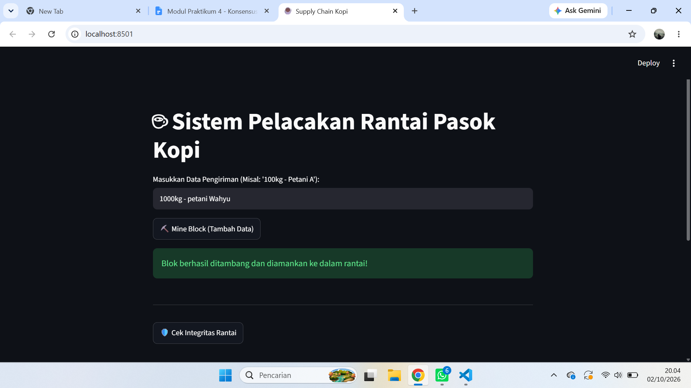

PRAKTIKUM BLOKCHAIN PERTEMUAN3

Tujuan Praktikum

1.  mahaiswa mampu memahami konsep Mempool dan validasi transaksi sebelum masuk ke dalam blok.
2.  Mahasiswa mampu mengimplementasikan algoritma Proof of weak(poW) pada struktur Blokchain lokal.
3.  Mahasiswa memahami fungsi nonce (Number Only Used Once) dan Difficulty dalam proses mining.
4.  Mahasiswa mampu memvalidasi integritas rantai secara keseluruhan menggunakan skrip Python.

