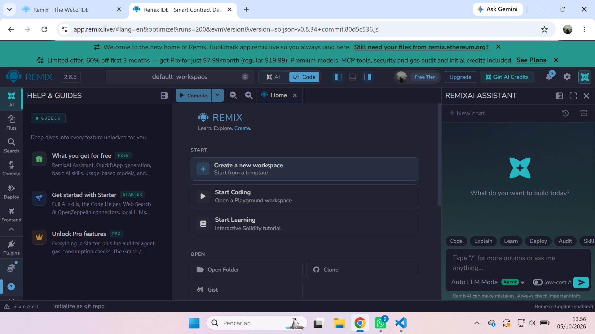
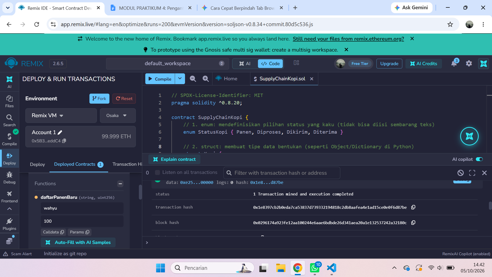
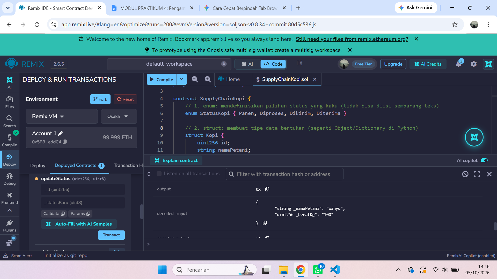

# Praktikum 6 : Membuat  smart contract dengan solidity di Remix #

## tujuan pembelajaran
Setelah menyelesaikan praktikum ini, mahasiswa di harapkan mampu:
1. memahami konsep dari smatr contract pada blokchain.
2. menggunakan platform remix untuk menulis, mengompilasi, dan men-deploy smart contract berbasis solidity.
3. mengimplementasikan fungsionalitas dasar smart contract yang sudah ter-deploy melalui remix.
4. melakukan interaksi dengan smart contract yang sudah ter-deploy melalui remix.
### proses praktikum ###

1. buka [Remix IDE](https://remix.ethereum.org/) login via Gmail,bukti:

2. buat file baru di files dengan nama SupplyChainKopi.sol
isi koding dengan modul
3. lakukan kompilasi dengan menekan tombol di samping kiri SupplyChainKopi.sol

4. Deploy smart constract ke blokchain
